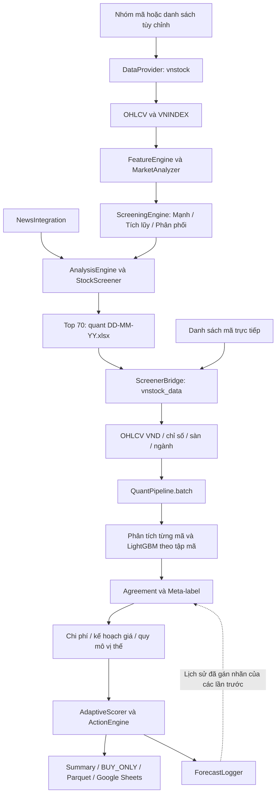
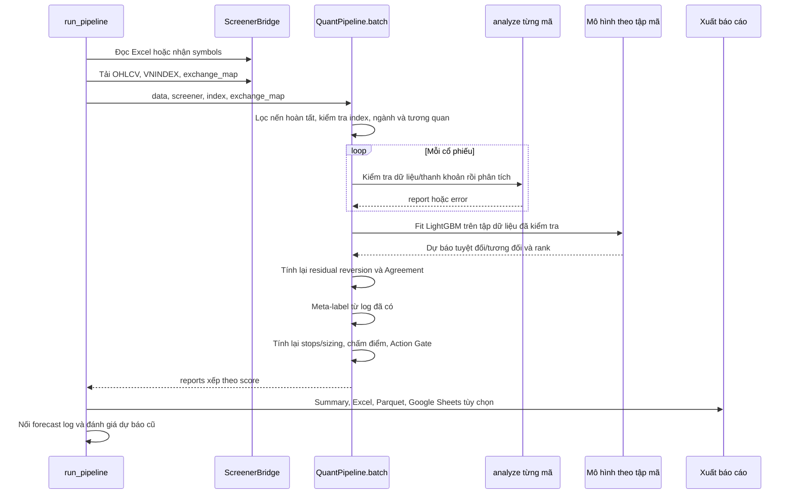
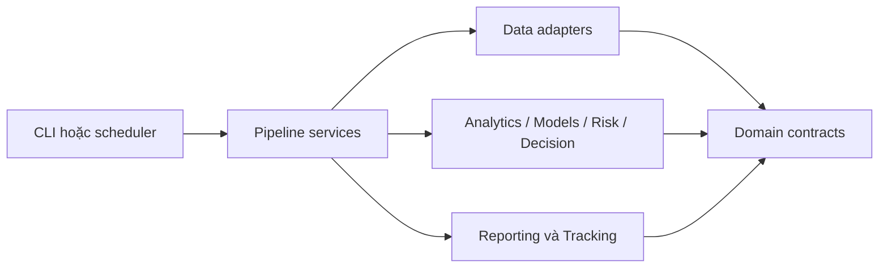

# Thiết kế cấu trúc chi tiết QuanTik

> Cơ sở: toàn bộ `crawl_data.py` (2.011 dòng) và `quant.py` (4.715 dòng) bản local ngày 25/09/2026. Xem [phạm vi](README.md) và [danh mục mã nguồn](DANH_MUC_MA_NGUON.md). Phần 1–7 mô tả hiện trạng; phần 8–12 là đề xuất.

## 1. Mục tiêu và ranh giới hệ thống

QuanTik hiện là hệ thống phân tích cổ phiếu theo nến ngày, chạy theo đợt qua Python. Nó tạo danh sách theo dõi, dự báo định hướng, ước lượng rủi ro, kế hoạch giá và báo cáo. Hai file không chứa kết nối đặt lệnh môi giới hoặc bộ quản lý danh mục đang nắm giữ.

Hệ thống gồm hai tầng:

1. **Sàng lọc rộng:** `crawl_data.py` lấy danh sách mã, kiểm tra thanh khoản, tính 21 tiêu chí và lấy tối đa 70 mã.
2. **Phân tích sâu:** `quant.py` đọc danh sách đó hoặc nhận mã trực tiếp, tải lịch sử dài hơn, phân tích mô hình, chấm điểm và quyết định `BUY_NOW`, `WATCH`, `AVOID`.

Tin tức chỉ bổ sung ngữ cảnh ở tầng sàng lọc. Không thấy tính sentiment từ tin tức hoặc dùng tin tức làm biến đầu vào của LightGBM trong hai file. Không có phân tích báo cáo tài chính doanh nghiệp ở đây; Sharpe, CAGR và drawdown là thống kê giá.

## 2. Kiến trúc hiện tại



### 2.1. Các ranh giới đang tồn tại

| Ranh giới | Dữ liệu đi qua | Đặc điểm hiện tại |
|---|---|---|
| Nhà cung cấp → crawler | DataFrame OHLCV | Cột `time`, giá giữ theo nguồn, có `symbol` |
| Crawler → quant | Excel | Truyền danh sách mã và nhãn sàng lọc; quant tải lại OHLCV |
| Nhà cung cấp → quant | DataFrame OHLCV | DatetimeIndex; giá chuyển về VND |
| Engine → orchestrator | `dict` | Key ngắn như `stats`, `fcast`, `sl`, `pos`, `rec`; chưa có schema bắt buộc |
| Quant → báo cáo | DataFrame Summary | Nhiều chỉ số, nhãn hành động và nhận xét |
| Quant → module ngoài | Parquet | `cache/recommendations_latest.parquet`; docstring nói phục vụ `valuation.py` |
| Quant → học từ lịch sử | CSV | `forecast_log.csv`; vừa nối dự báo mới vừa cập nhật kết quả cũ |

Excel là cầu nối danh sách ứng viên, không phải kho OHLCV dùng chung. Cùng một mã có thể được tải lại ở hai bước và vào hai thời điểm khác nhau.

### 2.2. API nhà cung cấp đang được gọi

Các lời gọi dưới đây được chép về mặt cấu trúc từ mã hiện tại, không phải xác nhận tương thích với mọi phiên bản thư viện:

| Vị trí | Lời gọi |
|---|---|
| Crawler | `Vnstock().stock(symbol=..., source=...).quote.history(...)` |
| Danh sách crawler | `listing.all_symbols()` hoặc `listing.symbols_by_group(group=...)` |
| Quant cổ phiếu | `Market().equity(symbol=...).ohlcv(..., source=...)` |
| Quant chỉ số | `Market().index(symbol=...).ohlcv(...)`, lỗi thì thử nhánh equity |
| Sàn | `Reference().equity.list_by_exchange()`; fallback KBS Listing |
| Ngành | `Reference().equity.list_by_industry()`; fallback danh sách hard-code |

## 3. Chi tiết `crawl_data.py`

### 3.1. Trách nhiệm của tám class

| Class | Đầu vào | Xử lý | Đầu ra |
|---|---|---|---|
| `DataProvider` | Nguồn, mã, số ngày | Danh sách mã, OHLCV, chỉ số, bảng giá; retry và fallback | List mã hoặc DataFrame/None |
| `FeatureEngine` | OHLCV theo thời gian | MA, khối lượng, lợi nhuận, cấu trúc nến, mẫu giá, RS | DataFrame mở rộng hoặc giá trị mẫu hình |
| `ScreeningEngine` | Features | Ba nhóm, mỗi nhóm bảy tiêu chí | Điểm, tiêu chí, diễn giải, số đạt |
| `AnalysisEngine` | Features và ba bộ điểm | Nhãn tổng hợp, dòng tiền, xu hướng, sức mạnh | Nhận xét và tóm tắt giá |
| `MarketAnalyzer` | OHLCV chỉ số | Trend, money flow, ATR, regime, ngưỡng điều chỉnh | Dict bối cảnh và báo cáo text |
| `NewsIntegration` | Nguồn tin, mã | Lấy tin và tìm mã trong tiêu đề | Danh sách bài liên quan |
| `GoogleSheetsExporter` | Bảng kết quả | Google Sheets hoặc Excel dự phòng | URL hoặc đường dẫn |
| `StockScreener` | Danh sách/nhóm và tham số quét | Điều phối, lọc, xếp hạng, xuất | Top 70 và `_full_results` trong RAM |

### 3.2. Thu thập và chuẩn hóa

- Nguồn mặc định KBS; `_get_sources()` đặt nguồn được chọn trước rồi thêm VCI/KBS còn lại.
- OHLCV và chỉ số có tối đa ba lần gọi trên mỗi nguồn khi phát sinh exception; thời gian chờ mặc định 1 rồi 2 giây. Dữ liệu trả về nhưng không hợp lệ chuyển sang nguồn tiếp theo, không nhất thiết retry cùng nguồn.
- `ALL` gộp HOSE, HNX, UPCOM và loại mã trùng. `VNALL` đi qua `all_symbols()`.
- Từ chối OHLCV có NaN/Inf, ngày trùng, giá không dương, khối lượng âm hoặc high/low không bao được open/close.
- Nến ngày hiện tại chỉ được dùng từ 16:00 theo múi giờ Việt Nam. Đây là chính sách nhập dữ liệu của code.
- `lookback_days=90` là **ngày lịch**, không phải 90 phiên.
- Mỗi mã cần ít nhất 20 dòng và khối lượng trung bình 20 phiên ít nhất 100.000 cổ phiếu.
- Crawler chưa chuẩn hóa đơn vị giá thành VND như quant và chưa kiểm tra độ cũ theo cùng bộ quy tắc của quant.

### 3.3. Features và nguyên tắc thời gian

| Nhóm | Cột/phép tính |
|---|---|
| Xu hướng | `ma5`, `ma10`, `ma20`, `ma50` |
| Khối lượng | `vol_avg5/10/20`, `vol_ratio_20 = volume / vol_avg20` |
| Biên độ | `high20`, `prior_high20`, `low20`, `high52` (260 phiên), `range_20d` |
| Vị trí giá | `pct_of_high20 = close / high20` |
| Lợi nhuận | `pct_change_1d/5d/10d/20d`, lưu dạng tỷ lệ |
| Nến | Thân, bóng trên/dưới, tỷ lệ bóng trên |
| RS | Lợi nhuận cổ phiếu trừ chỉ số, 1 và 10 phiên |
| Cấu trúc | Đỉnh/đáy cục bộ, HH-HL, spring, failed breakout, absorption |

RS ghép theo ngày phiên sau chuẩn hóa múi giờ; không forward-fill chỉ số ở bước này. `prior_high20` dịch một phiên để breakout không tự dùng đỉnh của chính phiên đang xét.

Đỉnh/đáy cục bộ dùng `shift(-1)`: điểm đảo chiều tại t chỉ được xác nhận khi có t+1. Khi đánh giá snapshot hiện tại, điều đó có thể hợp lệ với các điểm quá khứ; khi backtest phải cắt dữ liệu tại thời điểm quyết định rồi tính lại, không tính trên toàn bộ lịch sử tương lai trước khi cắt.

### 3.4. Toàn bộ 21 tiêu chí

Mỗi tiêu chí có trọng số bằng nhau: `score = round(100 × số đạt / 7, 1)`.

| Mã | Điều kiện thực tế |
|---|---|
| S1 | RS một phiên > 0 |
| S2 | Volume / AvgVol20 ≥ 1,5 |
| S3 | Close / High20 ≥ 0,95 |
| S4 | AvgVol5 < AvgVol20; chưa kiểm tra riêng rằng giá đang điều chỉnh |
| S5 | Close ≥ đỉnh high của 20 phiên trước |
| S6 | Hai đỉnh cục bộ và hai đáy cục bộ gần nhất tăng dần trong cửa sổ 20 phiên |
| S7 | RS 10 phiên > 0 |
| A1 | (High20 − Low20) / Low20 ≤ 0,15 |
| A2 | AvgVol5 < AvgVol20 |
| A3 | Có phiên volume ≥ 2 lần trung bình 20 phiên và biến động giá > −2%, trong 20 phiên gần nhất |
| A4 | Close > MA20 |
| A5 | Close / High20 ≥ 0,90 |
| A6 | Có ít nhất 40 dòng; ít nhất 15/20 giá trị range gần nhất ≤ 0,15 |
| A7 | Trong 10 phiên gần nhất, low thủng low20 trước đó và close > open |
| D1 | Volume ratio ≥ 2 và trị tuyệt đối biến động ngày ≤ 1% |
| D2 | Bóng trên / biên độ nến ≥ 0,5 |
| D3 | Có high vượt đỉnh 20 phiên trước nhưng close quay xuống dưới đỉnh đó |
| D4 | Volume trung bình phiên giảm > phiên tăng trong 10 phiên gần nhất |
| D5 | Close < MA20 |
| D6 | Close thấp hơn High20 ít nhất 5% |
| D7 | Ít nhất ba phiên volume ratio ≥ 1,5 và biến động tuyệt đối ≤ 1,5% trong 10 phiên |

### 3.5. Thị trường và xếp hạng

`MarketAnalyzer` tính `combined_score = 0,6 × trend_score + 0,4 × money_flow_score`.

Trend gồm vị trí so MA20/50, MA20 > MA50, HH-HL và thay đổi 5/10/20 phiên. Money flow gồm volume ratio, volume 5/20, volume ngày tăng so với ngày giảm và tỷ lệ phiên tăng trong 10 phiên. Tỷ lệ phiên tăng của chỉ số này **không phải market breadth toàn thị trường**.

| Regime crawler | Điểm thị trường | Ngưỡng Mạnh | Ngưỡng Tích lũy | Ngưỡng Phân phối |
|---|---:|---:|---:|---:|
| BULL | ≥ 65 | 42,9 | 57,1 | 71,4 |
| SIDEWAY | ≥ 45 và < 65 | 57,1 | 57,1 | 57,1 |
| BEAR | < 45 | 71,4 | 57,1 | 42,9 |

Thiếu chỉ số trả `UNKNOWN`, nhưng nhánh ngưỡng mặc định vẫn giống SIDEWAY. Nhãn gốc do `AnalysisEngine` dùng các ngưỡng 57 và 43; nhãn `(Adj)` dùng bảng trên. Cần giữ cả hai để truy vết.

Kết quả sắp theo **Mạnh giảm dần → Tích lũy giảm dần → Phân phối tăng dần**, sau đó `head(70)`. Đây là sắp theo ưu tiên cột, không phải lấy 70 giá trị lớn nhất của `max(Mạnh, Tích lũy)`.

Tin được lấy một đợt trước vòng lặp; mỗi mã ghép tối đa ba tiêu đề. So khớp là substring mã trong tiêu đề viết hoa, chưa nhận diện thực thể doanh nghiệp. `BatchCrawler` được khởi tạo nhưng luồng lấy tin đang dùng `Crawler.get_articles()`.

## 4. Chi tiết `quant.py`

### 4.1. Điều phối thực tế



`analyze()` riêng lẻ chưa tương đương kết quả cuối `batch()`: LightGBM là placeholder, score còn `PENDING`, và chưa có quyết định mua cuối. Batch tính lại một số kết quả sau khi đủ ngữ cảnh liên mã.

### 4.2. Nhập liệu và cổng kiểm tra đầu vào

`ScreenerBridge` có chuỗi mặc định KBS → VCI. Truyền `source='KBS'` hoặc `'VCI'` sẽ chỉ dùng một nguồn. Mỗi nguồn phải trả ít nhất 30 nến để được chấp nhận; có khoảng nghỉ 0,8 giây khi chuyển nguồn, không giống retry ba lần của crawler.

`fetch_ohlcv(days=252)` lấy khoảng ngày lịch `max(int(days × 1,7), days + 90)` rồi giữ tối đa `days` dòng cuối. `read_screener_excel()` nhận cột mã theo tên không dấu, nếu không tìm được dùng cột đầu tiên; chỉ giữ chuỗi ba chữ cái. `_find_latest()` chọn file khớp pattern có thời gian sửa mới nhất và bỏ file khóa `~$`.

Giá chuẩn hóa mặc định từ nghìn VND sang VND. Chế độ `AUTO` suy đoán dựa trên median close < 1.000, vì vậy không phải metadata đơn vị chắc chắn. Normalizer từ chối dữ liệu hỏng trước khi làm sạch và gắn `price_unit`, `source`; cutoff nến gắn thêm `as_of`, `excluded_unfinished_rows`.

`DataQualityEngine`:

- Lỗi trực tiếp nếu thiếu OHLCV, không hữu hạn, volume âm, index không hợp lệ/không tăng dần, hoặc ngày tương lai.
- Trừ điểm cho lịch sử < 120 dòng, ngày trùng, OHLC sai, giá không dương, nhiều phiên volume 0, thiếu phiên, dữ liệu cũ và bước nhảy giá.
- `FAIL` khi có cờ INVALID/NONPOSITIVE/STALE/DUPLICATE hoặc điểm < 55; `PASS` từ 80; còn lại `WARN`.
- `MIN_HISTORY=120` là ngưỡng trừ điểm, **không phải điều kiện loại tuyệt đối độc lập**.
- Thiếu phiên và độ cũ dùng ngày làm việc thứ Hai–thứ Sáu của NumPy, chưa có lịch nghỉ giao dịch Việt Nam.

`LiquidityEngine` tính ADV20 theo cổ phiếu và giá trị, gap percentile 95, Amihud, số phiên gần trần/sàn. Tier A ≥ 50 tỷ, B ≥ 20 tỷ, C ≥ 5 tỷ, còn lại D. Pass yêu cầu ADV20 ≥ 5 tỷ VND và tỷ lệ phiên volume 0 không quá 20%. Capacity bằng 5% ADV20 cổ phiếu, làm tròn xuống theo lô.

### 4.3. Ngành và quan hệ liên mã

`SectorEngine` ưu tiên ICB level 2; fallback danh sách thủ công, mã trùng lấy nhóm xuất hiện đầu tiên. Map được cache trong process. Xu hướng ngành dùng trung bình log-return của **các mã đang phân tích**, sau đó cộng dồn 5/20/60 phiên và chuyển ngược thành lợi nhuận.

`CrossCorrelationEngine` căn các chuỗi return trên giao của ngày có dữ liệu, cần ít nhất 40 quan sát và hai mã. Nó cung cấp correlation matrix, CCF lag −2..+2, mô tả dẫn/trễ; VAR giới hạn tám mã có variance cao nhất, chọn lag bằng AIC và kiểm tra Granger. Đây là quan hệ thống kê trong mẫu, không phải bằng chứng nhân quả kinh tế.

Các hàm dòng tiền ngành riêng lấy `close × volume` của ngày cuối và phân loại tăng/đứng/giảm với ngưỡng ±0,15%. `DongTienRong_ty` là chênh lệch GTGD nhóm tăng và nhóm giảm, không phải dòng tiền mua ròng đo từ bên chủ động giao dịch. Các ngành hard-code vẫn có mã trùng, nên không cộng thẳng thành toàn thị trường.

### 4.4. Mô hình và chức năng

| Engine | Phương pháp | Vai trò trong quyết định |
|---|---|---|
| `DistributionAnalyzer` | JB, Shapiro, Anderson, D’Agostino, KS; fit normal/t/Laplace theo AIC; tail statistics | Chẩn đoán phân phối |
| `StatEngine` | CAGR, annualized vol, Sharpe, Sortino, Calmar, VaR/CVaR, drawdown, autocorrelation | Thống kê và yếu tố xếp hạng |
| `ARIMAEngine` | ARIMA(p,0,q) trên return, p/q 0..4 bỏ (0,0), chọn AIC | Dự báo tham khảo; không bỏ phiếu Agreement V7 |
| `GARCHEngine` | GARCH(1,1)-t và EGARCH-t | Biến động, leverage và tham số mô phỏng |
| `HMMEngine` | Bốn features chuẩn hóa; ba states; mười lần khởi tạo; chọn BIC | Regime, điều chỉnh trọng số; fallback MA20/50 |
| `AlphaEngine` | RSI, MACD, ROC, OBV, RS/beta/alpha proxy | Composite kỹ thuật cho ranking; MR cũ đã deprecated |
| `StructureEngine` | Swing extrema, cluster theo ATR, efficiency ratio, hồi quy giá, CMF | Hỗ trợ/kháng cự, chất lượng xu hướng và dòng tiền |
| `MomentumAlphaEngine` | Momentum 5/10/20/60 với trọng số 0,20/0,35/0,30/0,15; trend quality | Một phiếu định hướng |
| `HurstRegimeEngine` | R/S trên return, nhiều cửa sổ, độ ổn định và R² | Router; không bỏ phiếu hướng |
| `ConditionalResidualReversionEngine` | Hồi quy stock return theo market/sector; robust z residual 5 ngày | Phiếu hồi quy có điều kiện |
| `CrossSectionalLightGBMEngine` | Hai LGBMRegressor, 19 features, nhãn absolute và relative forward return | Một phiếu định hướng và xếp hạng tương đối |
| `FcastEngine` | Mô phỏng GARCH-t hoặc fallback | Phân phối tương lai và rủi ro trong thời gian khóa |
| `AgreementEngine` | Tổng hợp ba directional components | Hướng, lợi nhuận dự báo, agreement/coverage/support, timing |
| `MetaLabelEngine` | Logistic regression có regularization trên kết quả đã ghi nhận | Cổng độ tin cậy bổ sung |

HMM dùng return, rolling volatility, tỷ lệ volume và momentum ngắn. State được đặt tên theo thứ hạng mean của chiều return. Tham số số states có thể thay đổi nhưng logic đặt tên hiện thiết kế cho ba states.

LightGBM cần ít nhất năm mã và 400 hàng training. Nhãn mặc định 10 phiên: `target_abs_pct` là forward return; `target_alpha_pct` trừ 50% market forward return và 50% sector forward return. Train/validation theo ngày 80/20 với khoảng bỏ dữ liệu bằng horizon; mô hình cuối fit lại trên toàn bộ hàng có nhãn. Đây chưa phải một quy trình walk-forward hoàn chỉnh hay kết quả chứng minh lợi nhuận chiến lược.

Conditional MR cần dữ liệu và factors đủ dài, `|residual_z| ≥ 1,25`, Hurst mean-reverting hoặc HMM SIDEWAY probability ≥ 55%, efficiency < 0,45 và regime không CRISIS/UNKNOWN.

### 4.5. Agreement V7

Trọng số cơ sở: momentum 0,40; LightGBM 0,45; residual reversion 0,15. Hurst/HMM điều chỉnh các trọng số đó. Component có trọng số dương, hướng khác 0 và strength > 0 mới là active.

Với `w` là trọng số sau routing, `d` là hướng và `s` là strength:

```text
vote_score = Σ_active(w × d × s)
forecast_return = Σ_active(w × projection_pct) / Σ_active(w)
coverage_pct = 100 × Σ_active(w) / Σ_all(w)
support_pct = 100 × abs(vote_score) / Σ_all(w)
agreement_pct = 100 × Σ_active_cùng_hướng(w) / Σ_active(w)
```

Hướng cuối chỉ tồn tại khi dấu phiếu và dấu dự báo vượt vùng trung tính ±0,5% đồng nhất. MC mean, HMM và Hurst không được đếm là directional vote.

`signal_strong` cần hướng tăng, dự báo > 2%, ít nhất hai component active, coverage ≥ 60%, agreement ≥ 65%, support ≥ 25%. Regime CRISIS/BEAR giới hạn biên dự báo; timing còn xét xác suất lỗ quá 3% trong lock < 20%.

`agreement_pct` không phải xác suất thắng. `meta_trust_probability` cũng chưa phải xác suất trade đã calibration độc lập; code giữ `p_trade_win_calibrated=None` và EV chưa được tính. Tên cột `confidence` trong forecast dict là alias của agreement; trong Parquet nó lại dùng xác suất calibration: cần tách hợp đồng rõ ràng.

### 4.6. Meta-label và vòng phản hồi

Meta-label lấy 17 features về agreement, components, Hurst/HMM, lock, liquidity, gap, cost và net forecast. Cần ít nhất 80 mẫu có đủ cột, nhãn 0/1 và cả hai lớp; nếu có `forecast_dir` thì chỉ dùng hướng UP. Mô hình dùng imputer → StandardScaler → LogisticRegression với `C=0.5`, balanced classes.

- WARMUP: chưa có mô hình, không tự hạ timing chỉ vì thiếu mẫu.
- TRAINED: probability < 0,50 chặn; từ 0,50 đến dưới 0,58 theo dõi; ≥ 0,58 chỉ giữ READY nếu các cổng trước đã READY.
- Validation hiện chia 80/20 theo thứ tự dòng đã sort `run_date`; chưa purge theo thời điểm nhãn trưởng thành.
- Lần chạy hiện tại áp dụng meta trước khi logger evaluate lịch sử, nên nhãn mới đánh giá ở cuối chỉ có tác dụng từ lần tiếp theo.

`ForecastLogger` lưu ngày/giá gốc, horizon, forecast, entry/SL/TP1 và meta features. Evaluate lấy phiên thực tế sau ngày gốc, loại ngày hiện tại, đủ horizon mới chấm hướng. Nhãn trade là TP1 trước SL; chạm cùng bar coi như không thắng. Cách gán nhãn này chưa mô phỏng đầy đủ khả năng bán trong T-lock, phí, khớp lệnh và gap.

### 4.7. Distribution risk và quy mô vị thế

MC mặc định 1.000 đường × 10 phiên; seed cố định theo mã bằng BLAKE2b. Return log được winsorize 2%/98%, drift nhân 0,25. Nếu có tham số hợp lệ, `alpha + beta < 1` và Student-t degrees of freedom phù hợp, variance được cập nhật đệ quy từng đường; nếu không dùng forecast volatility hoặc historical volatility.

Kết quả gồm interval 2,5%–97,5%, mean/median path, xác suất tăng trong mô phỏng và các thống kê trong hai phiên khóa. Biến động CRISIS nhân 2. Đây là mô phỏng phân phối, không khẳng định xác suất thực nghiệm đã hiệu chỉnh.

`RiskEng.stops()`:

1. Entry lấy close cuối, ATR theo rolling true range.
2. Khi optimization tắt: SL 2 ATR, TP1 1,5 ATR, TP2 3 ATR trước điều chỉnh.
3. Khoảng SL có sàn 1,5%, đối chiếu 1,1 × |VaR95|, trần 12%; làm tròn tick theo sàn.
4. Chuyển RR cơ sở sang risk sau điều chỉnh; thu TP2 theo meta trust hoặc support.
5. Giới hạn TP theo percentile 90 của historical favorable excursion.
6. Kế hoạch cần `0 < SL < entry < TP1 < TP2`, lợi ích có trọng số vượt chi phí vòng giao dịch.
7. Đánh dấu lock risk nếu historical MAE trong hai phiên sâu hơn stop buffer.

`RiskEng.sizing()` chọn số cổ phiếu nhỏ nhất giữa ba giới hạn, sau làm tròn lô:

```text
shares_risk       = floor_lot(NAV × 2% / abs(entry − stop))
shares_allocation = floor_lot(NAV × 15% / entry)
shares_liquidity  = capacity_shares
shares_final      = min(shares_risk, shares_allocation, shares_liquidity)
```

Các tỷ lệ là mặc định trong code. Chưa trừ vốn đang dùng bởi mã khác hoặc gộp tổng risk danh mục. `max_loss` là loss lý thuyết tại stop, chưa cộng phí/gap/T-lock. Kelly bị tắt trong luồng chính vì thống kê ngày tăng không phải thống kê giao dịch.

`CostEngine` tính `2 × commission_bps + sell_tax_bps + 2 × slippage_bps`; mặc định commission 15 bps/chiều, tax 10 bps, slippage là max giữa base 8 và mức theo tier. Tổng chi phí cơ sở tier A/B là 56 bps = 0,56%; C là 0,64%; D là 0,90%. Đây là giả định cấu hình.

### 4.8. Điểm và Action Gate

`AdaptiveScorer` có 12 factors, chuẩn hóa robust theo median/IQR và giới hạn [-1,1]. Điểm cross-sectional bắt đầu 50 và cộng 40 lần tổng có trọng số. Trộn 50% absolute score để giảm phụ thuộc universe, điều chỉnh regime và cộng/trừ theo nhãn screener. Nếu dưới hai report hợp lệ, dùng absolute fallback.

Regime quant khác crawler: `BULL`, `NEUTRAL`, `WEAK`, `BEAR`, `CRISIS`, `UNKNOWN`. CRISIS xét tổ hợp giảm 1/5 phiên theo cấu hình; ngoài ra dùng MA20/50 và return. Không được xem nhãn BULL ở hai tầng là cùng một phép phân loại.

| Điều kiện | Hành vi ActionEngine |
|---|---|
| Sàn/index không xác định; data fail; liquidity fail; crisis; timing BLOCKED; forecast không hữu hạn; plan sai; size 0 | AVOID bất kể score |
| Score ≥ 75, regime không BEAR/WEAK, không có reason nào | BUY_NOW |
| Score ≥ 65, net ≥ 1%, regime khác BEAR, không hard block | WATCH |
| Score ≥ 50, net > 0, không hard block | WATCH |
| Còn lại | AVOID |

`SETTLEMENT_LOCK_RISK`, `NET_FORECAST_TOO_LOW` và `TIMING_NOT_READY` ngăn BUY_NOW nhưng không nằm trong danh sách hard-block AVOID trực tiếp. `BUY_SETUP` có nhãn tương thích trong vài exporter nhưng `ActionEngine.decide()` hiện không sinh trạng thái này.

## 5. Dữ liệu và đầu ra hiện tại

### 5.1. Cầu nối Excel

| Nhóm cột crawler | Cách quant dùng |
|---|---|
| `Mã CK` | Chọn universe |
| `Tín hiệu`, `Tín hiệu (Adj)` | Tìm cột đầu khớp tên; hiện thường lấy `Tín hiệu` gốc |
| Ba bộ điểm | Được xuất nhưng `batch()` chưa nạp vào biến `scores`, vẫn None |
| Giá, tin, nhận xét, VNI score | Ngữ cảnh cho người đọc; không phải OHLCV đầu vào mô hình quant |

### 5.2. Report trong RAM

| Key | Ý nghĩa |
|---|---|
| `symbol`, `exchange`, `date`, `n`, `range` | Danh tính và phạm vi |
| `data_quality`, `liquidity` | Cổng dữ liệu và thanh khoản |
| `dist`, `stats`, `vol`, `ac` | Thống kê |
| `arima`, `garch`, `hmm`, `hurst` | Mô hình và regime |
| `alpha`, `momentum_alpha`, `conditional_mr`, `lightgbm_cross_sectional` | Features/alpha |
| `sr`, `trend`, `flow`, `sector`, `cross_corr` | Cấu trúc và bối cảnh |
| `fcast` | MC risk và directional agreement hiện chung trong một dict |
| `costs`, `sl`, `pos` | Chi phí, kế hoạch, quy mô |
| `rec`, `action` | Điểm xếp hạng và quyết định cuối |
| `error` | Lỗi hoặc lý do loại; report lỗi vẫn có thể vào Summary |
| `_price_dates`, `_price_close`, `fcast._mc_paths` | Dữ liệu nội bộ cho đánh giá/biểu đồ, không phù hợp đẩy toàn bộ vào bảng người dùng |

### 5.3. Artifact và side effect

| Artifact | Tạo trong luồng mặc định? | Nội dung |
|---|---|---|
| `quant DD-MM-YY.xlsx` | Có khi crawler có kết quả | Sheet `Kết quả lọc`, tối đa 70 mã |
| `khuyến nghị DD-MM-YY.xlsx` | Có khi quant có Summary | `Summary`, `BUY_ONLY` chỉ nhận BUY_NOW |
| `quant_dashboard_architecture.xlsx` | Có nếu đường dẫn không rỗng | Architecture, recommendations, DQ, liquidity, risk, models, sector, config |
| `cache/recommendations_latest.parquet` | Có nếu Summary không rỗng và có engine Parquet | Dữ liệu cho consumer khác |
| `forecast_log.csv` | Có khi khởi tạo logger thành công | Nối dự báo, cập nhật kết quả đã đủ phiên |
| Google Sheets | Quant mặc định bật; crawler CLI mặc định tắt | Summary và Buy_Only; tên sheet có timestamp theo phút |
| Visuals | Tắt mặc định | Gọi module ngoài `quant_visuals` khi bật |
| Forecast sheet | Không được `run_pipeline()` gọi | Hàm hỗ trợ còn tồn tại |
| Sector cashflow | Không được `run_pipeline()` chạy | Tham số `export_sector_flow` bị bỏ qua; có hàm độc lập cần data truyền sẵn |

Parquet mapping thực tế: BUY_NOW → BUY, BUY_SETUP → WATCH, WATCH → HOLD, còn lại AVOID. Không có hành động SELL tự động trong mapping này. `agreement` về thang 0–1; `confidence` lấy từ xác suất calibration và hiện thường thiếu.

Giá trong model, Summary Excel và Parquet là VND. Bảng đơn giản hóa cho Google Sheets và sheet khuyến nghị của architecture workbook chia giá cho 1.000 nhưng tiêu đề Entry/SL/TP chưa ghi đơn vị rõ.

## 6. Thư viện và vận hành

| Nhóm | Thư viện thấy trong source | Khi thiếu |
|---|---|---|
| Cốt lõi | numpy, pandas | Không import được chương trình |
| Crawler | vnstock | Không khởi tạo DataProvider |
| Quant provider | vnstock_data | Lỗi khi lazy-load Market/Reference; có fallback theo từng nhánh |
| Thống kê | scipy | Một số engine không có fallback import |
| ARIMA/VAR | statsmodels | Trả error ở nhánh import; không bao phủ mọi lỗi fitting |
| Volatility | arch | Trả error, MC có fallback |
| HMM | hmmlearn | Fallback MA |
| Cross-sectional | lightgbm | Mô hình unavailable, component abstain |
| Meta | scikit-learn | WARMUP kèm warning khi không fit được |
| Excel | openpyxl | Export không thành công |
| Parquet | pyarrow hoặc fastparquet | Bỏ export nếu thiếu cả hai |
| Tin tức | vnstock_news | Không có tin nếu import không được |
| Google Sheets | gspread; crawler còn oauth2client | Lỗi export hoặc fallback Excel ở crawler |

Không suy ra phiên bản đã kiểm chứng chỉ từ import. Khi triển khai cần môi trường ảo mới hoặc môi trường hiện có hợp lệ, kiểm tra gói dịch vụ và API discovery trước khi đổi adapter. API key nên nằm trong `.env` riêng hoặc kho secrets; source hiện không có logic nạp `.env` rõ ràng ở hai file này.

## 7. Những giới hạn kiến trúc hiện tại

- Hai file lớn trộn nghiệp vụ, nhà cung cấp, cấu hình, narrative và export.
- `CFG` toàn cục được reset mỗi lần `run_pipeline()`. Truyền cfg cho `QuantPipeline` chỉ tác động một phần vì nhiều engine đọc global CFG.
- Có nhiều khái niệm khác nhau cùng tên confidence, regime, win rate và forecast.
- Chưa có snapshot/run ID dùng xuyên suốt để chứng minh hai bước dùng cùng thời điểm dữ liệu.
- Snapshot ngành và universe là hiện tại; không đủ cho backtest tránh survivorship bias nếu dùng hồi tố.
- Chưa có budget danh mục tổng, đối chiếu holdings hoặc thực thi lệnh.
- Xuất file cố định có thể ghi đè; logging dự báo chưa có khóa idempotency.
- Ngoại lệ một số mô hình có thể làm dừng cả batch vì vòng gọi `analyze()` chưa cô lập exception theo mã.
- Nội dung narrative cũ và metadata một số exporter chưa đồng bộ với Action Gate hiện tại.

Danh sách lỗi cụ thể và tiêu chí sửa ở [kế hoạch triển khai](KE_HOACH_TRIEN_KHAI.md).

## 8. Cấu trúc thư mục đề xuất

Đề xuất bắt đầu bằng **một package Python có module rõ trách nhiệm**, giữ CLI hiện có làm wrapper. Chưa cần tách microservice. Cây dưới đây là thiết kế, chưa phải các file đã tạo:

```text
QuanTik/
├── README.md
├── pyproject.toml
├── crawl_data.py                 # Wrapper tương thích
├── quant.py                      # Wrapper tương thích
├── docs/
├── src/quantik/
│   ├── config.py                 # Cấu hình có kiểm tra và dependency injection
│   ├── domain/
│   │   ├── contracts.py          # Snapshot, report, quyết định và trạng thái model
│   │   ├── enums.py              # Regime, Action, DataStatus, ModelStatus
│   │   └── units.py              # VND, tỷ lệ, phần trăm, bps
│   ├── data/
│   │   ├── providers/base.py     # Interface provider
│   │   ├── providers/vnstock.py  # Adapter API hiện hành đã xác minh
│   │   ├── providers/unified.py
│   │   ├── normalization.py
│   │   ├── calendar.py           # Phiên giao dịch và cutoff
│   │   ├── quality.py
│   │   ├── reference.py          # Sàn, ngành, provenance
│   │   ├── news.py
│   │   └── snapshots.py          # Đọc/ghi snapshot có version
│   ├── screening/
│   │   ├── features.py
│   │   ├── rules.py              # 21 tiêu chí
│   │   ├── assessment.py
│   │   └── service.py
│   ├── analytics/
│   │   ├── statistics.py
│   │   ├── distribution.py
│   │   ├── structure.py
│   │   ├── sectors.py
│   │   └── correlation.py
│   ├── models/
│   │   ├── arima.py
│   │   ├── volatility.py
│   │   ├── hmm.py
│   │   ├── hurst.py
│   │   ├── momentum.py
│   │   ├── residual_reversion.py
│   │   ├── cross_sectional.py
│   │   ├── agreement.py
│   │   └── meta_label.py
│   ├── risk/
│   │   ├── market_rules.py
│   │   ├── liquidity.py
│   │   ├── costs.py
│   │   ├── simulation.py
│   │   ├── trade_plan.py
│   │   ├── sizing.py
│   │   └── portfolio.py          # Bổ sung mới, cần holdings
│   ├── decision/
│   │   ├── scoring.py
│   │   └── action_gate.py
│   ├── reporting/
│   │   ├── view_models.py
│   │   ├── commentary.py
│   │   ├── excel.py
│   │   ├── sheets.py
│   │   ├── parquet.py
│   │   └── visuals.py
│   ├── tracking/
│   │   ├── forecasts.py
│   │   ├── outcomes.py
│   │   └── model_registry.py
│   ├── pipeline/
│   │   ├── screening.py
│   │   ├── quant.py
│   │   └── context.py
│   └── cli.py
├── tests/
│   ├── unit/
│   ├── integration/
│   ├── regression/
│   └── fixtures/                 # Dữ liệu giả lập, không dùng secrets
└── runtime/                      # Artifact runtime, không commit
    ├── snapshots/
    ├── runs/
    ├── models/
    └── logs/
```

### 8.1. Quy tắc phụ thuộc



Domain không import provider hay exporter. Engine tính toán không đọc Excel, gọi mạng hoặc tự xuất Google Sheets. Pipeline nhận provider, config, clock, repositories và exporters qua constructor. Reporting nhận quyết định cuối đã tạo, không tính lại hành động từ score.

### 8.2. Ánh xạ từ code cũ

| Khối hiện tại | Module đích |
|---|---|
| DataProvider + phần fetch của ScreenerBridge | `data/providers`, `normalization`, `calendar` |
| Đọc Excel của ScreenerBridge | Adapter đầu vào của `pipeline/screening` hoặc `reporting/excel` |
| Feature/Screening/AnalysisEngine | `screening/*` |
| MarketAnalyzer + `_detect_vni_regime` | Hai policy regime có tên và version; sau đó mới đánh giá thống nhất |
| DataQualityEngine | `data/quality.py` |
| SectorEngine + CrossCorrelationEngine | `analytics/sectors.py`, `correlation.py` |
| DistributionAnalyzer, StatEngine, StructureEngine | `analytics/*` |
| Các model đơn mã, LightGBM, Agreement, Meta | `models/*` |
| FcastEngine | `risk/simulation.py`, đổi tên vai trò rõ ràng |
| VNMarketRules, LiquidityEngine, CostEngine, RiskEng | `risk/*` |
| AdaptiveScorer, ActionEngine | `decision/*` |
| QuantPipeline.batch | `pipeline/quant.py` |
| ForecastLogger | `tracking/forecasts.py`, `outcomes.py` |
| Exporter và narrative | `reporting/*` |
| Grid search stop nội bộ | Nhánh nghiên cứu/backtest riêng, không bật trong live pipeline |

## 9. Hợp đồng dữ liệu đề xuất

Các schema dưới đây là hợp đồng nội bộ mới, không phải API Vnstock. Phiên bản đầu có thể dùng dataclass và validator thay vì áp dụng framework phức tạp.

### 9.1. RunContext và MarketSnapshot

| Trường | Kiểu/đơn vị | Bất biến |
|---|---|---|
| `run_id` | Chuỗi duy nhất | Xuyên suốt pipeline và artifact |
| `as_of` | Timestamp có múi giờ | Đóng băng đầu run |
| `session_date` | Ngày giao dịch | Chỉ phiên đã hoàn tất |
| `code_version`, `config_hash`, `schema_version` | Chuỗi | Đủ để truy vết |
| `universe_id`, `universe_symbols` | Chuỗi, list | Không thay đổi giữa training và ranking của cùng snapshot |
| `symbol`, `exchange` | Chuỗi, enum | Sàn xác định hoặc từ chối executable |
| `source`, `fetched_at` | Chuỗi, timestamp | Không làm mất nguồn khi fallback |
| `price_unit`, `adjustment_policy` | `VND`, enum | Không suy đoán đơn vị ở tầng model |
| `bars` | OHLCV với session index | Tăng dần, duy nhất, hữu hạn, geometry hợp lệ |

Chỉ số dùng đơn vị **điểm**, tách khỏi VND của cổ phiếu. Return vẫn so sánh được nhưng báo cáo không nhân VNINDEX lên 1.000 như giá cổ phiếu.

### 9.2. ScreeningResult

Một bản ghi/mã/phiên gồm `symbol`, `snapshot_id`, ba bộ criterion booleans, ba scores, `raw_signal`, `adjusted_signal`, `screening_regime`, `eligibility`, `reason_codes`, `rank`, `selected`. Giá trị criterion chưa đủ dữ liệu dùng trạng thái `UNAVAILABLE` riêng, không âm thầm đồng nhất với False.

Adapter Excel hiện tại chuyển sang schema này ngay khi nhập. Luồng mới truyền trực tiếp object hoặc Parquet snapshot cho quant; vẫn xuất Excel để người dùng đọc. Lưu toàn bộ kết quả và danh sách bị loại, không chỉ Top 70, để kiểm tra thiên lệch lựa chọn.

### 9.3. ModelResult và DirectionalForecast

| Hợp đồng | Trường chính |
|---|---|
| `ModelResult` | model_name/version, status, reason, as_of, training_cutoff, feature_version, metrics |
| `DirectionalComponent` | direction −1/0/+1, strength 0–1, projection_pct, active, abstain_reason |
| `DirectionalForecast` | components, routed_weights, direction, return_pct, agreement_pct, coverage_pct, support_pct |
| `DistributionRisk` | innovation family, horizon_sessions, interval, lock_risk, model assumptions |
| `MetaGateResult` | WARMUP/TRAINED/UNAVAILABLE, trust_probability, validation metrics, decision |

Không dùng một field `confidence` cho ba nghĩa. NaN/Inf bị chặn tại boundary. Thiếu mô hình không biến thành phiếu trung tính giả có độ tin cậy cao; abstain giữ nguyên ý nghĩa mẫu số coverage.

### 9.4. TradePlan, Position và Decision

- `TradePlan`: entry_reference, entry_assumption, stop, tp1, tp2, horizon, exchange, price_unit, construction_method, valid, reasons.
- `Position`: requested_shares, allowed_shares, risk_budget, allocation_budget, liquidity_capacity, binding_constraints; số cổ phiếu theo lô.
- `Decision`: action, executable, rank_score, timing_status, blockers, warnings, run_id, policy_version.
- Chỉ `ActionGate` được tạo `Decision`. Mọi Excel/Sheets/Parquet/narrative lấy cùng quyết định này.
- `BUY_SETUP` chỉ bổ sung khi có schema trigger/expiry rõ ràng; trước đó không coi là mua đã được phép.

### 9.5. ForecastRecord và Outcome

Khóa idempotency đề xuất: `(symbol, base_session, horizon_sessions, model_version, policy_version)`. Tách `created_at`, `label_matured_at`, `evaluated_at` để meta-model chỉ dùng nhãn đã biết tại as_of.

Outcome gồm directional hit, TP/SL first-touch, execution feasibility, gross/net realized return và lý do không giao dịch. Nhãn “TP1 trước SL” phải ghi tên rõ; không đồng nhất với “giao dịch sinh lời sau chi phí”. Dùng chung quy tắc settlement và gap với backtest.

## 10. Thiết kế pipeline và xử lý lỗi đề xuất

1. Đóng băng config, clock và universe; tạo run manifest.
2. Lấy/reference snapshot theo ngày; ghi nguồn và trạng thái từng mã.
3. Normalize/cutoff/DQ một lần; dùng chung dữ liệu cho screening và quant khi cùng cửa sổ.
4. Kiểm tra index và tính market context một lần.
5. Tính features vectorized; screening toàn bộ universe; chọn ứng viên bằng policy có version.
6. Tính thống kê và model đơn mã. Mỗi model trả `ModelResult`; lỗi mã A không làm mất báo cáo của B.
7. Fit/infer mô hình cross-sectional với training_cutoff rõ; dự báo chỉ trên cùng phiên as_of.
8. Tổng hợp directional alpha, distribution risk và meta gate.
9. Tạo trade plan, sizing và kiểm tra vốn/risk danh mục nếu có holdings.
10. Chấm điểm rồi Action Gate; đóng băng quyết định cuối.
11. Xuất view models và ghi forecast theo cơ chế idempotent.
12. Hoàn tất manifest với trạng thái từng exporter; output cục bộ và push từ xa có thể retry riêng.

| Lỗi | Chính sách đề xuất |
|---|---|
| Nhà cung cấp timeout | Retry có giới hạn và jitter, fallback; lưu nguyên nhân |
| OHLCV hỏng/không xác định đơn vị | Loại nguồn hoặc mã; không âm thầm sửa thành dữ liệu hợp lệ |
| Index thiếu/cũ | Tiếp tục báo cáo quan sát nhưng chặn executable |
| Model không hội tụ | UNAVAILABLE/FALLBACK; coverage và provenance phản ánh đúng |
| Một exporter lỗi | Giữ artifact thành công; run PARTIAL; retry đúng exporter |
| Chạy lại cùng snapshot | Không tạo forecast trùng; không ghi đè kết quả đã công bố mà mất lịch sử |

Không bật song song gọi provider mặc định. Khi tối ưu, chỉ tăng concurrency trong giới hạn quota đã xác minh; đặt giới hạn CPU để tránh nhiều worker cùng chạy LightGBM `n_jobs=-1`.

## 11. Báo cáo và khả năng kiểm toán đề xuất

Màn hình/bảng Summary nên ưu tiên: mã, phiên dữ liệu, action, lý do, score, net forecast, liquidity, entry/SL/TP, size. Chi tiết model nằm trong bảng phụ. Mọi cột giá ghi rõ VND hoặc nghìn VND; mọi tỷ lệ có suffix thống nhất `_ratio`, `_pct`, `_bps`.

BUY_ONLY chỉ chứa executable decisions. Trường hợp không có mã mua vẫn tạo bảng rỗng kèm run/session hiện tại để tránh người dùng đọc nhầm danh sách mua cũ. Nhận xét phải kết thúc bằng quyết định cuối và lý do; score cao nhưng bị chặn phải hiển thị rõ bị chặn.

Run manifest cần số mã yêu cầu/thành công/bị loại, source breakdown, phiên cuối, số model fallback, training sample counts, model versions, export status và thời gian từng stage. Không ghi credentials hoặc API key vào log/artifact.

## 12. Quyết định thiết kế cần giữ

| Quyết định | Lý do | Đánh đổi |
|---|---|---|
| Modular monolith trước | Dễ chạy trên môi trường cá nhân và giữ tương thích | Chưa phân tán tải |
| Snapshot là đầu vào chuẩn | Tái lập và tránh hai bước lệch thời điểm | Cần quản lý lưu trữ/version |
| Action Gate là nguồn quyết định duy nhất | Báo cáo không mâu thuẫn logic mua | Phải sửa các exporter cũ |
| Tách alpha/risk/regime | Không đếm MC/HMM như phiếu tăng độc lập | Hợp đồng nhiều thành phần hơn |
| Giữ missing và zero khác nhau | Tránh thay xác suất 0 bằng default | Cần validator rõ ràng |
| Tách research khỏi live | Tránh tối ưu trên mẫu rồi coi là edge ngoài mẫu | Cần quy trình promote model |
| Config truyền tường minh | Test được, nhiều run không ảnh hưởng nhau | Thay chữ ký một số engine |
| Lịch giao dịch dùng chung | DQ, horizon, settlement và nhãn thống nhất | Cần cập nhật dữ liệu lịch |

Lộ trình cụ thể và bộ kiểm thử nghiệm thu được trình bày trong [Kế hoạch triển khai](KE_HOACH_TRIEN_KHAI.md).
